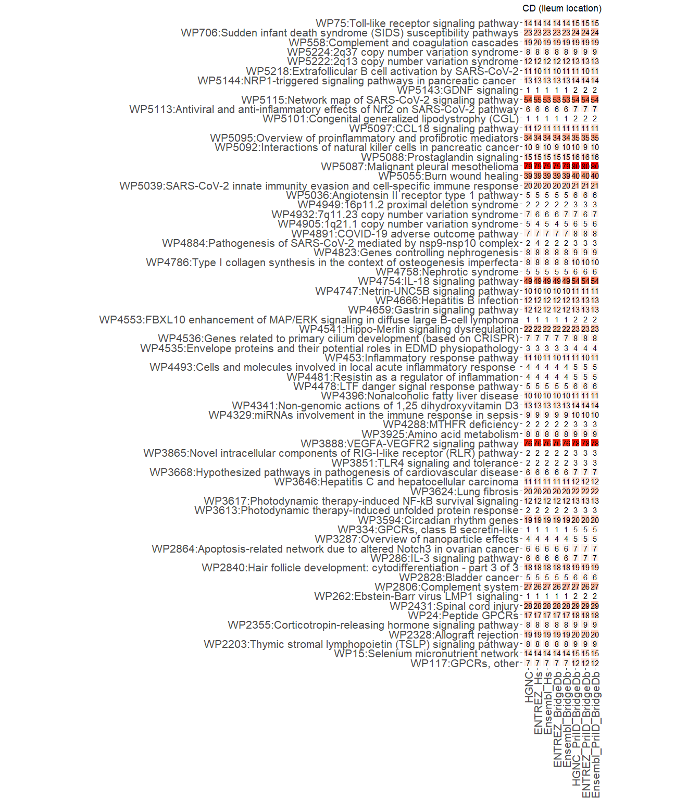
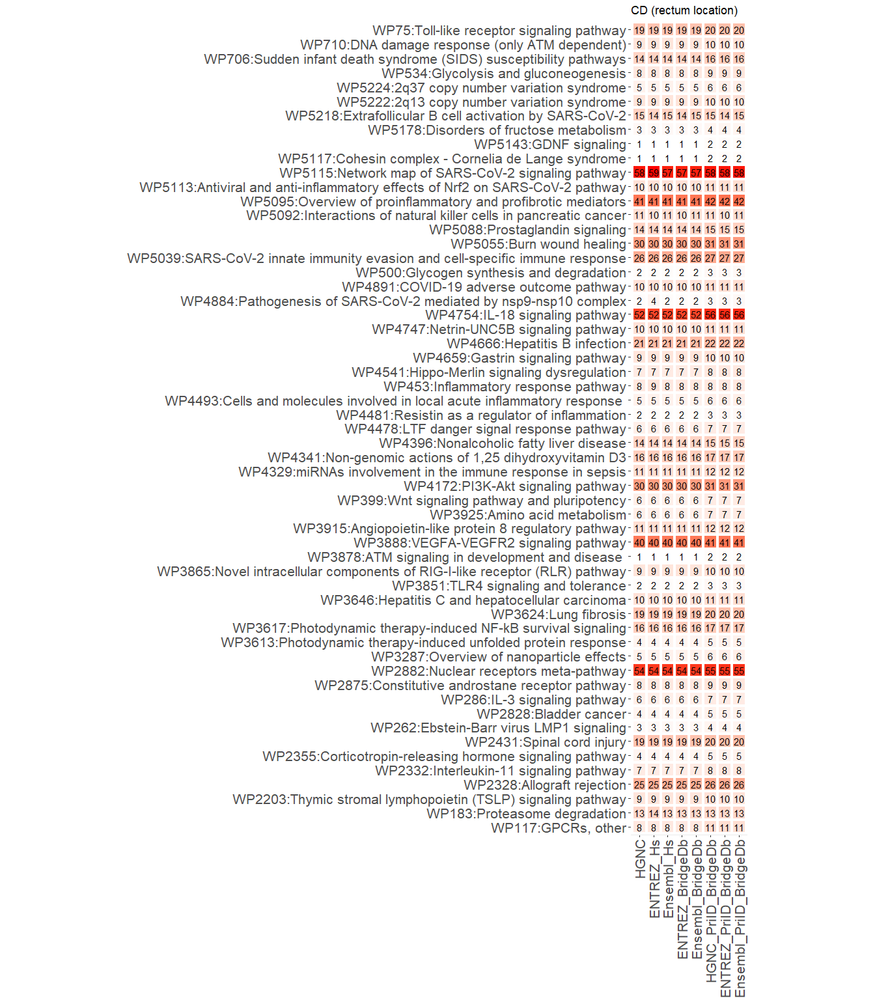
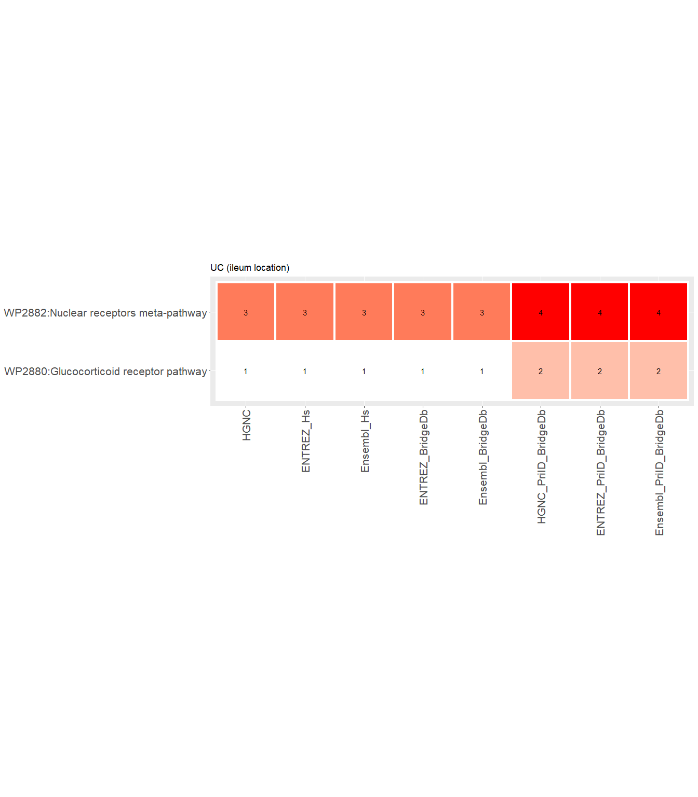
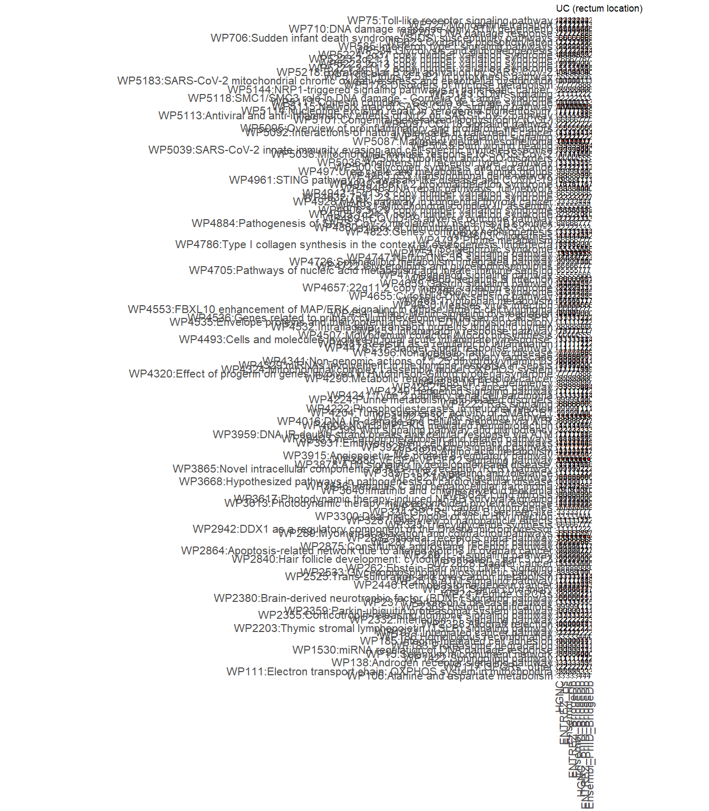

## Introduction

In this section, we will map the significantly changed transcripts to
pathways from the WikiPathways and Reactome collection, in order to
investigate the potential difference in statistical calculations
depending on the input identifiers (IDs). We will work with three IDs:
HGNC symbols, Entrez (NCBI) gene IDs and Ensembl. The first was present
in the original dataset, while the second and third are generated with
different mapping tools (org.Hs and BridgeDbR). We will use the SPARQL
endpoint interface to compare our dataset to the content of both pathway
databases. Other approaches exist (e.g. gProfiler), however not all of
these approaches allow performing their analysis with different
identifiers.

## R environment setup

``` r
# empty the R environment
rm (list = ls())
# check if libraries are already installed, otherwise install it
if(!requireNamespace("BiocManager", quietly = TRUE)) install.packages("BiocManager")
if(!"rstudioapi" %in% installed.packages()) BiocManager::install("rstudioapi")
if(!"dplyr" %in% installed.packages()) install.packages("dplyr")
if(!"data.table" %in% installed.packages()) install.packages("data.table")
if(!"knitr" %in% installed.packages()) install.packages("knitr")
if(!"SPARQL" %in% installed.packages()) install.packages("SPARQL")
# alternative way to intall this package if you get this warning "package ‘SPARQL’ is not available for this version of R"
if(!"SPARQL" %in% installed.packages()) install.packages("https://cran.r-project.org/src/contrib/Archive/SPARQL/SPARQL_1.16.tar.gz", repos = NULL, type="source")
if(!"reshape2" %in% installed.packages()) install.packages("reshape2")
if(!"ggplot2" %in% installed.packages()) install.packages("ggplot2")

#loading installed libraries
suppressPackageStartupMessages({
  library(rstudioapi) # interface for interacting with RStudio IDE with R code.
  library(dplyr)
  library(data.table)
  library(knitr)
  library(SPARQL)
  library(reshape2)
  library(ggplot2)
  })

# set your working environment to the location where your current source file is saved into.
setwd(dirname(rstudioapi::getSourceEditorContext()$path))
```

## Importing dataset and subsetting genes with significant changes

The data from step 1 will be read in and further processed. For a fairer
comparison, we report how many rows per ID type contain a significantly
changed gene.

``` r
#we have four datasets, two different disorders and two different biopsy locations. In the first script, identifier_mapping_transcriptomics.Rmd, we merged the data from two locations in one dataset and we added the mapping data using Hs.org and BridgeDb (with and without secondary to primary mapping).  
dataset_CD <- read.delim("../1-identifier_mapping_transcriptomics/results/IDMapping_CD")
dataset_UC <- read.delim("../1-identifier_mapping_transcriptomics/results/IDMapping_UC")

#The following selection criteria will be used to determine the significantly changed transcripts Fold change = 1.5, log2FC = 0.58 and p.value < 0.05.
#CD dataset
## Significant rows
sig.rows.ileum_CD <- which((dataset_CD$log2FC_ileum >= 0.58 | dataset_CD$log2FC_ileum <= -0.58) & dataset_CD$pvalue_ileum < 0.05) #ileum location
sig.rows.rectum_CD <- which((dataset_CD$log2FC_rectum >= 0.58 | dataset_CD$log2FC_rectum <= -0.58) & dataset_CD$pvalue_rectum < 0.05) #rectum location
##HGNC_Symbols:
sig.genes.ileum_HGNC_CD <- dataset_CD$GeneSymbol[sig.rows.ileum_CD] #ileum location
sig.genes.rectum_HGNC_CD <- dataset_CD$GeneSymbol[sig.rows.rectum_CD] #rectum location
## org.Hs
### Entrez ID:
sig.genes.ileum_ENTREZ_Hs_CD <- na.omit(dataset_CD$ENTREZ.ID_org.Hs[sig.rows.ileum_CD]) #ileum location
sig.genes.rectum_ENTREZ_Hs_CD <- na.omit(dataset_CD$ENTREZ.ID_org.Hs[sig.rows.rectum_CD]) #rectum location
### Ensembl IDs:
sig.genes.ileum_Ensembl_Hs_CD <- na.omit(dataset_CD$Ensembl.ID_org.Hs[sig.rows.ileum_CD]) #ileum location
sig.genes.rectum_Ensembl_Hs_CD <- na.omit(dataset_CD$Ensembl.ID_org.Hs[sig.rows.rectum_CD]) #rectum location
## BridgeDb
### Entrez ID:
sig.genes.ileum_ENTREZ_BridgeDb_CD <- na.omit(dataset_CD$ENTREZ.ID_BridgeDb[sig.rows.ileum_CD]) #ileum location
sig.genes.rectum_ENTREZ_BridgeDb_CD <- na.omit(dataset_CD$ENTREZ.ID_BridgeDb[sig.rows.rectum_CD]) #rectum location
### Ensembl IDs:
sig.genes.ileum_Ensembl_BridgeDb_CD <- na.omit(dataset_CD$Ensembl.ID_BridgeDb[sig.rows.ileum_CD]) #ileum location
sig.genes.rectum_Ensembl_BridgeDb_CD <- na.omit(dataset_CD$Ensembl.ID_BridgeDb[sig.rows.rectum_CD]) #rectum location
## Primary id mapping,BridgeDb,
### primary HGNC Symbols:
sig.genes.ileum_HGNC_PriID_BridgeDb_CD <- dataset_CD$Current_GeneSymbol[sig.rows.ileum_CD] #ileum location
sig.genes.rectum_HGNC_PriID_BridgeDb_CD <- dataset_CD$Current_GeneSymbol[sig.rows.rectum_CD] #rectum location
### Entrez ID:
sig.genes.ileum_ENTREZ_PriID_BridgeDb_CD <- na.omit(dataset_CD$ENTREZ.ID_PriID_BridgeDb[sig.rows.ileum_CD]) #ileum location
sig.genes.rectum_ENTREZ_PriID_BridgeDb_CD <- na.omit(dataset_CD$ENTREZ.ID_PriID_BridgeDb[sig.rows.rectum_CD]) #rectum location
### Ensembl IDs:
sig.genes.ileum_Ensembl_PriID_BridgeDb_CD <- na.omit(dataset_CD$Ensembl.ID_PriID_BridgeDb[sig.rows.ileum_CD]) #ileum location
sig.genes.rectum_Ensembl_PriID_BridgeDb_CD <- na.omit(dataset_CD$Ensembl.ID_PriID_BridgeDb[sig.rows.rectum_CD]) #rectum location

#UC dataset
## Significant rows
sig.rows.ileum_UC <- which((dataset_UC$log2FC_ileum >= 0.58 | dataset_UC$log2FC_ileum <= -0.58) & dataset_UC$pvalue_ileum < 0.05) #ileum location
sig.rows.rectum_UC <- which((dataset_UC$log2FC_rectum >= 0.58 | dataset_UC$log2FC_rectum <= -0.58) & dataset_UC$pvalue_rectum < 0.05) #rectum location
##HGNC_Symbols:
sig.genes.ileum_HGNC_UC <- dataset_UC$GeneSymbol[sig.rows.ileum_UC] #ileum location
sig.genes.rectum_HGNC_UC <- dataset_UC$GeneSymbol[sig.rows.rectum_UC] #rectum location
## org.Hs
### Entrez ID:
sig.genes.ileum_ENTREZ_Hs_UC <- na.omit(dataset_UC$ENTREZ.ID_org.Hs[sig.rows.ileum_UC]) #ileum location
sig.genes.rectum_ENTREZ_Hs_UC <- na.omit(dataset_UC$ENTREZ.ID_org.Hs[sig.rows.rectum_UC]) #rectum location
### Ensembl IDs:
sig.genes.ileum_Ensembl_Hs_UC <- na.omit(dataset_UC$Ensembl.ID_org.Hs[sig.rows.ileum_UC]) #ileum location
sig.genes.rectum_Ensembl_Hs_UC <- na.omit(dataset_UC$Ensembl.ID_org.Hs[sig.rows.rectum_UC]) #rectum location
## BridgeDb
### Entrez ID:
sig.genes.ileum_ENTREZ_BridgeDb_UC <- na.omit(dataset_UC$ENTREZ.ID_BridgeDb[sig.rows.ileum_UC]) #ileum location
sig.genes.rectum_ENTREZ_BridgeDb_UC <- na.omit(dataset_UC$ENTREZ.ID_BridgeDb[sig.rows.rectum_UC]) #rectum location
### Ensembl IDs:
sig.genes.ileum_Ensembl_BridgeDb_UC <- na.omit(dataset_UC$Ensembl.ID_BridgeDb[sig.rows.ileum_UC]) #ileum location
sig.genes.rectum_Ensembl_BridgeDb_UC <- na.omit(dataset_UC$Ensembl.ID_BridgeDb[sig.rows.rectum_UC]) #rectum location
## Primary id mapping,BridgeDb,
### primary HGNC Symbols:
sig.genes.ileum_HGNC_PriID_BridgeDb_UC <- dataset_UC$Current_GeneSymbol[sig.rows.ileum_UC] #ileum location
sig.genes.rectum_HGNC_PriID_BridgeDb_UC <- dataset_UC$Current_GeneSymbol[sig.rows.rectum_UC] #rectum location
### Entrez ID:
sig.genes.ileum_ENTREZ_PriID_BridgeDb_UC <- na.omit(dataset_UC$ENTREZ.ID_PriID_BridgeDb[sig.rows.ileum_UC]) #ileum location
sig.genes.rectum_ENTREZ_PriID_BridgeDb_UC <- na.omit(dataset_UC$ENTREZ.ID_PriID_BridgeDb[sig.rows.rectum_UC]) #rectum location
### Ensembl IDs:
sig.genes.ileum_Ensembl_PriID_BridgeDb_UC <- na.omit(dataset_UC$Ensembl.ID_PriID_BridgeDb[sig.rows.ileum_UC]) #ileum location
sig.genes.rectum_Ensembl_PriID_BridgeDb_UC <- na.omit(dataset_UC$Ensembl.ID_PriID_BridgeDb[sig.rows.rectum_UC]) #rectum location
```

##Sign. Mapping stats:

``` r
##HGNC_originalData
MappingStats <- data.table(`  ` =  c("#genes in the transcriptomics dataset" ,
                                     "#significant genes with HGNC Symbol IDs for CD (ileum location)", 
                                     "#significant genes with HGNC Symbol IDs for CD (rectum location)",
                                     "#significant genes with HGNC Symbol IDs for UC (ileum location)",
                                     "#significant genes with HGNC Symbol IDs for UC (rectum location)",
                                     "#unique Entrez IDs in the transcriptomics dataset" ,
                                     "#significant genes with Entrez IDs for CD (ileum location)",
                                     "#significant genes with Entrez IDs for CD (rectum location)",
                                     "#significant genes with Entrez IDs for UC (ileum location)",
                                     "#significant genes with Entrez IDs for UC (rectum location)",
                                     "#unique Ensembl IDs in the transcriptomics dataset" ,
                                     "#significant genes with Ensembl IDs for CD (ileum location)",
                                     "#significant genes with Ensembl IDs for CD (rectum location)",
                                     "#significant genes with Ensembl IDs for UC (ileum location)",
                                     "#significant genes with Ensembl IDs for UC (rectum location)"),
                           org.Hs = c(nrow (dataset_CD), 
                                      length(sig.genes.ileum_HGNC_CD), length(sig.genes.rectum_HGNC_CD), 
                                      length(sig.genes.ileum_HGNC_UC), length(sig.genes.rectum_HGNC_UC),
                                      nrow(dataset_CD[na.omit(dataset_CD$ENTREZ.ID_org.Hs),]), 
                                      length(sig.genes.ileum_ENTREZ_Hs_CD), length(sig.genes.rectum_ENTREZ_Hs_CD), 
                                      length(sig.genes.ileum_ENTREZ_Hs_UC), length(sig.genes.rectum_ENTREZ_Hs_UC),
                                      nrow(dataset_CD[na.omit(dataset_CD$Ensembl.ID_org.Hs),]), 
                                      length(sig.genes.ileum_Ensembl_Hs_CD), length(sig.genes.rectum_Ensembl_Hs_CD), 
                                      length(sig.genes.ileum_Ensembl_Hs_UC), length(sig.genes.rectum_Ensembl_Hs_UC)),
                           BridgeDb = c(nrow(dataset_CD), 
                                      length(sig.genes.ileum_HGNC_CD), length(sig.genes.rectum_HGNC_CD), 
                                      length(sig.genes.ileum_HGNC_UC),  length(sig.genes.rectum_HGNC_UC),
                                      nrow(dataset_CD[na.omit(dataset_CD$ENTREZ.ID_BridgeDb),]), 
                                      length(sig.genes.ileum_ENTREZ_BridgeDb_CD), length(sig.genes.rectum_ENTREZ_BridgeDb_CD), 
                                      length(sig.genes.ileum_ENTREZ_BridgeDb_UC), length(sig.genes.rectum_ENTREZ_BridgeDb_UC),
                                      nrow(dataset_CD[na.omit(dataset_CD$Ensembl.ID_BridgeDb),]), 
                                      length(sig.genes.ileum_Ensembl_BridgeDb_CD), length(sig.genes.rectum_Ensembl_BridgeDb_CD), 
                                      length(sig.genes.ileum_Ensembl_BridgeDb_UC), length(sig.genes.rectum_Ensembl_BridgeDb_UC)),
                           PrimaryID_BridgeDb = c(nrow(dataset_CD), 
                                      length(sig.genes.ileum_HGNC_PriID_BridgeDb_CD), length(sig.genes.rectum_HGNC_PriID_BridgeDb_CD), 
                                      length(sig.genes.ileum_HGNC_PriID_BridgeDb_UC), length(sig.genes.rectum_HGNC_PriID_BridgeDb_UC),
                                      nrow(dataset_CD[na.omit(dataset_CD$ENTREZ.ID_PriID_BridgeDb),]), 
                                      length(sig.genes.ileum_ENTREZ_PriID_BridgeDb_CD), length(sig.genes.rectum_ENTREZ_PriID_BridgeDb_CD), 
                                      length(sig.genes.ileum_ENTREZ_PriID_BridgeDb_UC), length(sig.genes.rectum_ENTREZ_PriID_BridgeDb_UC),
                                      nrow(dataset_CD[na.omit(dataset_CD$Ensembl.ID_PriID_BridgeDb),]), 
                                      length(sig.genes.ileum_Ensembl_PriID_BridgeDb_CD), length(sig.genes.rectum_Ensembl_PriID_BridgeDb_CD), 
                                      length(sig.genes.ileum_Ensembl_PriID_BridgeDb_UC),  length(sig.genes.rectum_Ensembl_PriID_BridgeDb_UC)))
kable(MappingStats)
```

|                                                                  | org.Hs | BridgeDb | PrimaryID_BridgeDb |
|:--------------------------------------------|-----:|-------:|-------------:|
| #genes in the transcriptomics dataset                            |  17670 |    17670 |              17670 |
| #significant genes with HGNC Symbol IDs for CD (ileum location)  |   1896 |     1896 |               1896 |
| #significant genes with HGNC Symbol IDs for CD (rectum location) |   1339 |     1339 |               1339 |
| #significant genes with HGNC Symbol IDs for UC (ileum location)  |    121 |      121 |                121 |
| #significant genes with HGNC Symbol IDs for UC (rectum location) |   6809 |     6809 |               6809 |
| #unique Entrez IDs in the transcriptomics dataset                |  15022 |    14133 |              15032 |
| #significant genes with Entrez IDs for CD (ileum location)       |   1697 |     1558 |               1651 |
| #significant genes with Entrez IDs for CD (rectum location)      |   1195 |     1114 |               1172 |
| #significant genes with Entrez IDs for UC (ileum location)       |     99 |       97 |                102 |
| #significant genes with Entrez IDs for UC (rectum location)      |   5870 |     5593 |               5936 |
| #unique Ensembl IDs in the transcriptomics dataset               |  14596 |    15009 |              15997 |
| #significant genes with Ensembl IDs for CD (ileum location)      |   1665 |     1695 |               1796 |
| #significant genes with Ensembl IDs for CD (rectum location)     |   1171 |     1195 |               1256 |
| #significant genes with Ensembl IDs for UC (ileum location)      |     97 |       99 |                107 |
| #significant genes with Ensembl IDs for UC (rectum location)     |   5771 |     5864 |               6229 |

``` r
rm(list = setdiff(ls(), grep ("dataset_UC|dataset_CD|sig.genes", ls(), value = TRUE))) # removing variables that are not required
```

## Find pathways for each dataset, based on signifcantly changed genes and different IDs.

``` r
##Connect to Endpoint WikiPathways
endpointwp <- "https://sparql.wikipathways.org/sparql"
## 1. Query metadata:
queryMetadata <-
"SELECT DISTINCT ?dataset (str(?titleLit) as ?title) ?date ?license 
WHERE {
   ?dataset a void:Dataset ;
   dcterms:title ?titleLit ;
   dcterms:license ?license ;
   pav:createdOn ?date .
 }"
#below code should be performed first to handle the ssl certificate error
options(RCurlOptions = list(cainfo = paste0( tempdir() , "/cacert.pem" ), ssl.verifypeer = FALSE))
resultsMetadata <- SPARQL(endpointwp, queryMetadata, curl_args = list(useragent = R.version.string))
showresultsMetadata <- resultsMetadata$results
remove(queryMetadata, resultsMetadata)

#For now, filter out Reactome PWs due to visualization issues in Cytoscape.
item1 = "PREFIX hgnc: <https://identifiers.org/hgnc.symbol/>
PREFIX entrez: <https://identifiers.org/ncbigene/>
PREFIX ensembl: <https://identifiers.org/ensembl/>
PREFIX cur: <http://vocabularies.wikipathways.org/wp#Curation:>
select distinct ?pathwayRes (str(?wpid) as ?pathway) (str(?title) as ?pathwayTitle) (count(distinct ?geneId) AS ?GenesInPWs) (count(distinct ?geneDatanode) AS ?TotalGenesinPW)
where {
VALUES ?geneId {"
item2 = "}

{?geneDatanode  a wp:GeneProduct ;
            dcterms:isPartOf ?pathwayRes .}
 UNION
  
   {?geneDatanode   a wp:Protein ;          
            dcterms:isPartOf ?pathwayRes .}

  ?gene dcterms:isPartOf ?pathwayRes ;"
item3_HGNC= "
    wp:bdbHgncSymbol ?geneId ."
item3_ENTREZ= "
     wp:bdbEntrezGene ?geneId ."
item3_Ensembl= "
    wp:bdbEnsembl ?geneId ."
item4= "
  ?pathwayRes a wp:Pathway ;
              wp:organismName 'Homo sapiens' ; 
    dcterms:identifier ?wpid ;
    dc:title ?title .
    
  #?pathwayRes wp:ontologyTag cur:Reactome_Approved . 
  ?pathwayRes wp:ontologyTag cur:AnalysisCollection .   
}

ORDER BY DESC(?GenesInPWs)"

##Split significant genes into list of max. 220 entries (number based on Ensembl which has longest ID structure), to avoid SPARQL endpoint trowing a 414 error. 
##Merge the content of the split content back together for the output of the PW Analysis.

for (gene_list in ls(pattern = "sig.genes")){
  sig.genes = get (gene_list)
  IDsource = gsub ("_.*", "", gsub ("^[^_]+_", "", gene_list))
  item3 <- get (ls (pattern = paste0("item3_", IDsource)))
  if (IDsource == "HGNC") query <- paste0("hgnc:", sig.genes)
  if (IDsource == "Ensembl") query <- paste0("ensembl:", sig.genes)
  if (IDsource == "ENTREZ") query <- paste0("entrez:", sig.genes)

  split_query <- split(query, ceiling(seq_along(query) / 220))
  
  showresults_CombinePWs <- c()
  for (i in 1:length (split_query)) {
    string <- paste(split_query[[i]], collapse=' ')
    query_CombinePWs <- paste(item1, string, item2, item3, item4)
    results_CombinePWs <- SPARQL(endpointwp, query_CombinePWs, curl_args = list(useragent = R.version.string))
    showresults_CombinePWs <- rbind (showresults_CombinePWs, results_CombinePWs$results)
  }
  outputFile = paste0 ("results/CombinePWs", gsub ("sig.genes", "", gene_list), ".txt")
  (showresults_CombinePWs <- showresults_CombinePWs %>% 
    group_by(pathwayRes, pathway, pathwayTitle, TotalGenesinPW) %>% 
    summarise(GenesInPWs = sum(GenesInPWs)) %>%
    mutate(probabilities = dhyper(GenesInPWs, TotalGenesinPW, (length(query) - GenesInPWs), length(query), log = FALSE)) %>% # Calculate hypergeometric density p-value for all pathways.
    arrange(desc(GenesInPWs), probabilities)) %>%
    write.table(outputFile, sep = "\t" , quote = FALSE, row.names = FALSE)
  
  colnames(showresults_CombinePWs)[colnames(showresults_CombinePWs) == "GenesInPWs"] <- paste0 ("GenesInPWs", gsub ("sig.genes", "", gene_list))
  colnames(showresults_CombinePWs)[colnames(showresults_CombinePWs) == "probabilities"] <- paste0 ("probabilities", gsub ("sig.genes", "", gene_list))
  
  assign(paste0 ("CombinePWs", gsub ("sig.genes", "", gene_list)), showresults_CombinePWs)
  rm (sig.genes, IDsource, item3, query, split_query, showresults_CombinePWs, i, string, query_CombinePWs, results_CombinePWs, outputFile)
}
```

##Pathway Mapping stats:

``` r
MappingStats <- data.table(`  ` =  c("#genes in the transcriptomics dataset" ,
                                     "#significant genes with HGNC Symbol IDs for CD (ileum location)",
                                     "#pathways with HGNC Symbol IDs for CD (ileum location)",
                                     "#significant genes with HGNC Symbol IDs for CD (rectum location)",
                                     "#pathways with HGNC Symbol IDs for CD (rectum location)",
                                     "#significant genes with HGNC Symbol IDs for UC (ileum location)",
                                     "#pathways with HGNC Symbol IDs for UC (ileum location)",
                                     "#significant genes with HGNC Symbol IDs for UC (rectum location)",
                                     "#pathways with HGNC Symbol IDs for UC (rectum location)",
                                     
                                     "#significant genes with primary HGNC Symbol IDs for CD (ileum location)",
                                     "#pathways with primary HGNC Symbol IDs for CD (ileum location)",
                                     "#significant genes with primary HGNC Symbol IDs for CD (rectum location)",
                                     "#pathways with primary HGNC Symbol IDs for CD (rectum location)",
                                     "#significant genes with primary HGNC Symbol IDs for UC (ileum location)",
                                     "#pathways with primary HGNC Symbol IDs for UC (ileum location)",
                                     "#significant genes with primary HGNC Symbol IDs for UC (rectum location)",
                                     "#pathways with primary HGNC Symbol IDs for UC (rectum location)",
                                     
                                     "#unique Entrez IDs in the transcriptomics dataset" ,
                                     "#significant genes with Entrez IDs for CD (ileum location)",
                                     "#pathways with Entrez IDs for CD (ileum location)",
                                     "#significant genes with Entrez IDs for CD (rectum location)",
                                     "#pathways with Entrez IDs for CD (rectum location)",
                                     "#significant genes with Entrez IDs for UC (ileum location)",
                                     "#pathways with Entrez IDs for UC (ileum location)",
                                     "#significant genes with Entrez IDs for UC (rectum location)",
                                     "#pathways with Entrez IDs for UC (rectum location)",
                                     "#unique Ensembl IDs in the transcriptomics dataset" ,
                                     "#significant genes with Ensembl IDs for CD (ileum location)",
                                     "#pathways with Ensembl IDs for CD (ileum location)",
                                     "#significant genes with Ensembl IDs for CD (rectum location)",
                                     "#pathways with Ensembl IDs for CD (rectum location)",
                                     "#significant genes with Ensembl IDs for UC (ileum location)",
                                     "#pathways with Ensembl IDs for UC (ileum location)",
                                     "#significant genes with Ensembl IDs for UC (rectum location)",
                                     "#pathways with Ensembl IDs for UC (rectum location)"),
                           org.Hs = c(nrow (dataset_CD), 
                                      length(sig.genes.ileum_HGNC_CD), length(unique(CombinePWs.ileum_HGNC_CD$pathway)),
                                      length(sig.genes.rectum_HGNC_CD), length(unique(CombinePWs.rectum_HGNC_CD$pathway)),
                                      length(sig.genes.ileum_HGNC_UC), length(unique(CombinePWs.ileum_HGNC_UC$pathway)), 
                                      length(sig.genes.rectum_HGNC_UC), length(unique(CombinePWs.rectum_HGNC_UC$pathway)),
                                      "-", "-", "-", "-", "-", "-", "-", "-",
                                      nrow (dataset_CD[na.omit(dataset_CD$ENTREZ.ID_org.Hs),]), 
                                      length(sig.genes.ileum_ENTREZ_Hs_CD), length(unique(CombinePWs.ileum_ENTREZ_Hs_CD$pathway)),
                                      length(sig.genes.rectum_ENTREZ_Hs_CD), length(unique(CombinePWs.rectum_ENTREZ_Hs_CD$pathway)),
                                      length(sig.genes.ileum_ENTREZ_Hs_UC), length(unique(CombinePWs.ileum_ENTREZ_Hs_UC$pathway)),
                                      length(sig.genes.rectum_ENTREZ_Hs_UC), length(unique(CombinePWs.rectum_ENTREZ_Hs_UC$pathway)),
                                      nrow (dataset_CD[na.omit(dataset_CD$Ensembl.ID_org.Hs),]), 
                                      length(sig.genes.ileum_Ensembl_Hs_CD), length(unique(CombinePWs.ileum_Ensembl_Hs_CD$pathway)),
                                      length(sig.genes.rectum_Ensembl_Hs_CD), length(unique(CombinePWs.rectum_Ensembl_Hs_CD$pathway)),
                                      length(sig.genes.ileum_Ensembl_Hs_UC), length(unique(CombinePWs.ileum_Ensembl_Hs_UC$pathway)),
                                      length(sig.genes.rectum_Ensembl_Hs_UC), length(unique(CombinePWs.rectum_Ensembl_Hs_UC$pathway))),
                           BridgeDb = c(nrow (dataset_CD), 
                                      length(sig.genes.ileum_HGNC_CD), length(unique(CombinePWs.ileum_HGNC_CD$pathway)),
                                      length(sig.genes.rectum_HGNC_CD), length(unique(CombinePWs.rectum_HGNC_CD$pathway)),
                                      length(sig.genes.ileum_HGNC_UC), length(unique(CombinePWs.ileum_HGNC_UC$pathway)),
                                      length(sig.genes.rectum_HGNC_UC), length(unique(CombinePWs.rectum_HGNC_UC$pathway)),
                                      "-", "-", "-", "-", "-", "-", "-", "-",
                                      nrow (dataset_CD[na.omit(dataset_CD$ENTREZ.ID_BridgeDb),]), 
                                      length(sig.genes.ileum_ENTREZ_BridgeDb_CD), length(unique(CombinePWs.ileum_ENTREZ_BridgeDb_CD$pathway)),
                                      length(sig.genes.rectum_ENTREZ_BridgeDb_CD), length(unique(CombinePWs.rectum_ENTREZ_BridgeDb_CD$pathway)),
                                      length(sig.genes.ileum_ENTREZ_BridgeDb_UC), length(unique(CombinePWs.ileum_ENTREZ_BridgeDb_UC$pathway)),
                                      length(sig.genes.rectum_ENTREZ_BridgeDb_UC), length(unique(CombinePWs.rectum_ENTREZ_BridgeDb_UC$pathway)),
                                      nrow (dataset_CD[na.omit(dataset_CD$Ensembl.ID_BridgeDb),]), 
                                      length(sig.genes.ileum_Ensembl_BridgeDb_CD), length(unique(CombinePWs.ileum_Ensembl_BridgeDb_CD$pathway)),
                                      length(sig.genes.rectum_Ensembl_BridgeDb_CD), length(unique(CombinePWs.rectum_Ensembl_BridgeDb_CD$pathway)),
                                      length(sig.genes.ileum_Ensembl_BridgeDb_UC), length(unique(CombinePWs.ileum_Ensembl_BridgeDb_UC$pathway)),
                                      length(sig.genes.rectum_Ensembl_BridgeDb_UC), length(unique(CombinePWs.rectum_Ensembl_BridgeDb_UC$pathway))),
                           PrimaryID_BridgeDb = c(nrow (dataset_CD),
                                      length(sig.genes.ileum_HGNC_CD), length(unique(CombinePWs.ileum_HGNC_CD$pathway)),
                                      length(sig.genes.rectum_HGNC_CD), length(unique(CombinePWs.rectum_HGNC_CD$pathway)),
                                      length(sig.genes.ileum_HGNC_UC), length(unique(CombinePWs.ileum_HGNC_UC$pathway)),
                                      length(sig.genes.rectum_HGNC_UC), length(unique(CombinePWs.rectum_HGNC_UC$pathway)),
                                      length(sig.genes.ileum_HGNC_PriID_BridgeDb_CD), length(unique(CombinePWs.ileum_HGNC_PriID_BridgeDb_CD$pathway)),
                                      length(sig.genes.rectum_HGNC_PriID_BridgeDb_CD), length(unique(CombinePWs.rectum_HGNC_PriID_BridgeDb_CD$pathway)),
                                      length(sig.genes.ileum_HGNC_PriID_BridgeDb_UC), length(unique(CombinePWs.ileum_HGNC_PriID_BridgeDb_UC$pathway)),
                                      length(sig.genes.rectum_HGNC_PriID_BridgeDb_UC), length(unique(CombinePWs.rectum_HGNC_PriID_BridgeDb_UC$pathway)),
                                      nrow (dataset_CD[na.omit(dataset_CD$ENTREZ.ID_PriID_BridgeDb),]), 
                                      length(sig.genes.ileum_ENTREZ_PriID_BridgeDb_CD), length(unique(CombinePWs.ileum_ENTREZ_PriID_BridgeDb_CD$pathway)),
                                      length(sig.genes.rectum_ENTREZ_PriID_BridgeDb_CD), length(unique(CombinePWs.rectum_ENTREZ_PriID_BridgeDb_CD$pathway)),
                                      length(sig.genes.ileum_ENTREZ_PriID_BridgeDb_UC), length(unique(CombinePWs.ileum_ENTREZ_PriID_BridgeDb_UC$pathway)),
                                      length(sig.genes.rectum_ENTREZ_PriID_BridgeDb_UC), length(unique(CombinePWs.rectum_ENTREZ_PriID_BridgeDb_UC$pathway)),
                                      nrow (dataset_CD[na.omit(dataset_CD$Ensembl.ID_PriID_BridgeDb),]), 
                                      length(sig.genes.ileum_Ensembl_PriID_BridgeDb_CD), length(unique(CombinePWs.ileum_Ensembl_PriID_BridgeDb_CD$pathway)),
                                      length(sig.genes.rectum_Ensembl_PriID_BridgeDb_CD), length(unique(CombinePWs.rectum_Ensembl_PriID_BridgeDb_CD$pathway)),
                                      length(sig.genes.ileum_Ensembl_PriID_BridgeDb_UC), length(unique(CombinePWs.ileum_Ensembl_PriID_BridgeDb_UC$pathway)),
                                      length(sig.genes.rectum_Ensembl_PriID_BridgeDb_UC), length(unique(CombinePWs.rectum_Ensembl_PriID_BridgeDb_UC$pathway))))
kable(MappingStats)
```

|                                                                          | org.Hs | BridgeDb | PrimaryID_BridgeDb |
|:----------------------------------------------|:-----|:------|------------:|
| #genes in the transcriptomics dataset                                    | 17670  | 17670    |              17670 |
| #significant genes with HGNC Symbol IDs for CD (ileum location)          | 1896   | 1896     |               1896 |
| #pathways with HGNC Symbol IDs for CD (ileum location)                   | 611    | 611      |                611 |
| #significant genes with HGNC Symbol IDs for CD (rectum location)         | 1339   | 1339     |               1339 |
| #pathways with HGNC Symbol IDs for CD (rectum location)                  | 593    | 593      |                593 |
| #significant genes with HGNC Symbol IDs for UC (ileum location)          | 121    | 121      |                121 |
| #pathways with HGNC Symbol IDs for UC (ileum location)                   | 59     | 59       |                 59 |
| #significant genes with HGNC Symbol IDs for UC (rectum location)         | 6809   | 6809     |               6809 |
| #pathways with HGNC Symbol IDs for UC (rectum location)                  | 728    | 728      |                728 |
| #significant genes with primary HGNC Symbol IDs for CD (ileum location)  | \-     | \-       |               1896 |
| #pathways with primary HGNC Symbol IDs for CD (ileum location)           | \-     | \-       |                611 |
| #significant genes with primary HGNC Symbol IDs for CD (rectum location) | \-     | \-       |               1339 |
| #pathways with primary HGNC Symbol IDs for CD (rectum location)          | \-     | \-       |                594 |
| #significant genes with primary HGNC Symbol IDs for UC (ileum location)  | \-     | \-       |                121 |
| #pathways with primary HGNC Symbol IDs for UC (ileum location)           | \-     | \-       |                 60 |
| #significant genes with primary HGNC Symbol IDs for UC (rectum location) | \-     | \-       |               6809 |
| #pathways with primary HGNC Symbol IDs for UC (rectum location)          | \-     | \-       |                728 |
| #unique Entrez IDs in the transcriptomics dataset                        | 15022  | 14133    |              15032 |
| #significant genes with Entrez IDs for CD (ileum location)               | 1697   | 1558     |               1651 |
| #pathways with Entrez IDs for CD (ileum location)                        | 611    | 611      |                611 |
| #significant genes with Entrez IDs for CD (rectum location)              | 1195   | 1114     |               1172 |
| #pathways with Entrez IDs for CD (rectum location)                       | 593    | 593      |                594 |
| #significant genes with Entrez IDs for UC (ileum location)               | 99     | 97       |                102 |
| #pathways with Entrez IDs for UC (ileum location)                        | 59     | 59       |                 60 |
| #significant genes with Entrez IDs for UC (rectum location)              | 5870   | 5593     |               5936 |
| #pathways with Entrez IDs for UC (rectum location)                       | 728    | 728      |                728 |
| #unique Ensembl IDs in the transcriptomics dataset                       | 14596  | 15009    |              15997 |
| #significant genes with Ensembl IDs for CD (ileum location)              | 1665   | 1695     |               1796 |
| #pathways with Ensembl IDs for CD (ileum location)                       | 611    | 611      |                611 |
| #significant genes with Ensembl IDs for CD (rectum location)             | 1171   | 1195     |               1256 |
| #pathways with Ensembl IDs for CD (rectum location)                      | 593    | 593      |                594 |
| #significant genes with Ensembl IDs for UC (ileum location)              | 97     | 99       |                107 |
| #pathways with Ensembl IDs for UC (ileum location)                       | 59     | 59       |                 60 |
| #significant genes with Ensembl IDs for UC (rectum location)             | 5771   | 5864     |               6229 |
| #pathways with Ensembl IDs for UC (rectum location)                      | 728    | 728      |                728 |

## Combining pathways for the vidualization

``` r
CombinePWs_ileum_CD <- Reduce(function(x, y) merge(x, y, all = T), lapply(ls(pattern = "CombinePWs.ileum.*CD"), get), accumulate = F)
CombinePWs_ileum_CD %>% write.table("results/CombinePWs.ileum_CD.txt", sep = "\t" , quote = FALSE, row.names = FALSE)
CombinePWs_rectum_CD <- Reduce(function(x, y) merge(x, y, all = T), lapply(ls(pattern = "CombinePWs.rectum.*CD"), get), accumulate = F)
CombinePWs_rectum_CD %>% write.table("results/CombinePWs.rectum_CD.txt", sep = "\t" , quote = FALSE, row.names = FALSE)
CombinePWs_ileum_UC <- Reduce(function(x, y) merge(x, y, all = T), lapply(ls(pattern = "CombinePWs.ileum.*UC"), get), accumulate = F)
CombinePWs_ileum_UC %>% write.table("results/CombinePWs.ileum_UC.txt", sep = "\t" , quote = FALSE, row.names = FALSE)
CombinePWs_rectum_UC <- Reduce(function(x, y) merge(x, y, all = T), lapply(ls(pattern = "CombinePWs.rectum.*UC"), get), accumulate = F)
CombinePWs_rectum_UC %>% write.table("results/CombinePWs.rectum_UC.txt", sep = "\t" , quote = FALSE, row.names = FALSE)

#CD
##ileum
CombinePWs_ileum_CD_toPlot <- CombinePWs_ileum_CD [, !grepl("probabilities|pathwayRes|pathwayTitle|TotalGenesinPW", colnames (CombinePWs_ileum_CD))] %>% select (pathway, GenesInPWs.ileum_HGNC_CD, GenesInPWs.ileum_ENTREZ_Hs_CD, GenesInPWs.ileum_Ensembl_Hs_CD, GenesInPWs.ileum_ENTREZ_BridgeDb_CD, GenesInPWs.ileum_Ensembl_BridgeDb_CD, GenesInPWs.ileum_HGNC_PriID_BridgeDb_CD, GenesInPWs.ileum_ENTREZ_PriID_BridgeDb_CD, GenesInPWs.ileum_Ensembl_PriID_BridgeDb_CD)
colnames(CombinePWs_ileum_CD_toPlot) <- gsub ("GenesInPWs.ileum_|_CD", "", colnames(CombinePWs_ileum_CD_toPlot))
all_the_same <- apply(CombinePWs_ileum_CD_toPlot[-c(1, 2)], 1, function(x) all(x == x[1]))
#Keep the pathways with different number of GenesInPWs across different mappings
CombinePWs_ileum_CD_toPlot <- CombinePWs_ileum_CD_toPlot %>%
  filter(!all_the_same) %>%
  reshape2::melt() %>%
  mutate(pathway = paste0(pathway, ":", CombinePWs_ileum_CD$pathwayTitle[match(pathway, CombinePWs_ileum_CD$pathway)]),
         value = ifelse (is.na(value), 0, value))

(Int_PWs_ileum_CD <- unique(gsub (":.*", "", CombinePWs_ileum_CD_toPlot$pathway))) %>% 
  write.table("results/Int_PWs_ileum_CD.txt", sep = "\t" , quote = FALSE, row.names = FALSE)

ggplot(CombinePWs_ileum_CD_toPlot, aes(x = variable, y = pathway, fill = value)) +
  geom_tile(color = "white",
            lwd = 1.5,
            linetype = 1) +
  coord_fixed() +
  scale_fill_gradient(low = "white", high = "red") +
  labs(y = NULL, x = NULL) +
  geom_text(aes(label = value), color = "black", size = 4) +
  theme(axis.text.x = element_text(angle = 90, vjust = 0.5, hjust = 1, size = 16),
        axis.text.y = element_text(size = 16),
        legend.position = "none") +
  ggtitle("CD (ileum location)")
```



``` r
##rectum 
CombinePWs_rectum_CD_toPlot <- CombinePWs_rectum_CD [, !grepl("probabilities|pathwayRes|pathwayTitle|TotalGenesinPW", colnames (CombinePWs_rectum_CD))] %>% select (pathway, GenesInPWs.rectum_HGNC_CD, GenesInPWs.rectum_ENTREZ_Hs_CD, GenesInPWs.rectum_Ensembl_Hs_CD, GenesInPWs.rectum_ENTREZ_BridgeDb_CD, GenesInPWs.rectum_Ensembl_BridgeDb_CD, GenesInPWs.rectum_HGNC_PriID_BridgeDb_CD, GenesInPWs.rectum_ENTREZ_PriID_BridgeDb_CD, GenesInPWs.rectum_Ensembl_PriID_BridgeDb_CD)
colnames(CombinePWs_rectum_CD_toPlot) <- gsub ("GenesInPWs.rectum_|_CD", "", colnames(CombinePWs_rectum_CD_toPlot))
all_the_same <- apply(CombinePWs_rectum_CD_toPlot[-c(1, 2)], 1, function(x) all(x == x[1]))
#Keep the pathways with different number of GenesInPWs across different mappings
CombinePWs_rectum_CD_toPlot <- CombinePWs_rectum_CD_toPlot %>%
  filter(!all_the_same) %>%
  reshape2::melt() %>%
  mutate(pathway = paste0(pathway, ":", CombinePWs_rectum_CD$pathwayTitle[match(pathway, CombinePWs_rectum_CD$pathway)]),
         value = ifelse (is.na(value), 0, value))

(Int_PWs_rectum_CD <- unique(gsub (":.*", "", CombinePWs_rectum_CD_toPlot$pathway))) %>% 
  write.table("results/Int_PWs_rectum_CD.txt", sep = "\t" , quote = FALSE, row.names = FALSE)


ggplot(CombinePWs_rectum_CD_toPlot, aes(x = variable, y = pathway, fill = value)) +
  geom_tile(color = "white",
            lwd = 1.5,
            linetype = 1) +
  coord_fixed() +
  scale_fill_gradient(low = "white", high = "red") +
  labs(y = NULL, x = NULL) +
  geom_text(aes(label = value), color = "black", size = 4) +
  theme(axis.text.x = element_text(angle = 90, vjust = 0.5, hjust = 1, size = 16),
        axis.text.y = element_text(size = 16),
        legend.position = "none") +
  ggtitle("CD (rectum location)")
```



``` r
#UC
##ileum
CombinePWs_ileum_UC_toPlot <- CombinePWs_ileum_UC [, !grepl("probabilities|pathwayRes|pathwayTitle|TotalGenesinPW", colnames (CombinePWs_ileum_UC))] %>% select (pathway, GenesInPWs.ileum_HGNC_UC, GenesInPWs.ileum_ENTREZ_Hs_UC, GenesInPWs.ileum_Ensembl_Hs_UC, GenesInPWs.ileum_ENTREZ_BridgeDb_UC, GenesInPWs.ileum_Ensembl_BridgeDb_UC, GenesInPWs.ileum_HGNC_PriID_BridgeDb_UC, GenesInPWs.ileum_ENTREZ_PriID_BridgeDb_UC, GenesInPWs.ileum_Ensembl_PriID_BridgeDb_UC)
colnames(CombinePWs_ileum_UC_toPlot) <- gsub ("GenesInPWs.ileum_|_UC", "", colnames(CombinePWs_ileum_UC_toPlot))
all_the_same <- apply(CombinePWs_ileum_UC_toPlot[-c(1, 2)], 1, function(x) all(x == x[1]))
#Keep the pathways with different number of GenesInPWs across different mappings
CombinePWs_ileum_UC_toPlot <- CombinePWs_ileum_UC_toPlot %>%
  filter(!all_the_same) %>%
  reshape2::melt() %>%
  mutate(pathway = paste0(pathway, ":", CombinePWs_ileum_UC$pathwayTitle[match(pathway, CombinePWs_ileum_UC$pathway)]),
         value = ifelse (is.na(value), 0, value))

(Int_PWs_ileum_UC <- unique(gsub (":.*", "", CombinePWs_ileum_UC_toPlot$pathway))) %>% 
  write.table("results/Int_PWs_ileum_UC.txt", sep = "\t" , quote = FALSE, row.names = FALSE)

ggplot(CombinePWs_ileum_UC_toPlot, aes(x = variable, y = pathway, fill = value)) +
  geom_tile(color = "white",
            lwd = 1.5,
            linetype = 1) +
  coord_fixed() +
  scale_fill_gradient(low = "white", high = "red") +
  labs(y = NULL, x = NULL) +
  geom_text(aes(label = value), color = "black", size = 4) +
  theme(axis.text.x = element_text(angle = 90, vjust = 0.5, hjust = 1, size = 16),
        axis.text.y = element_text(size = 16),
        legend.position = "none") +
  ggtitle("UC (ileum location)")
```



``` r
##rectum 
CombinePWs_rectum_UC_toPlot <- CombinePWs_rectum_UC [, !grepl("probabilities|pathwayRes|pathwayTitle|TotalGenesinPW", colnames (CombinePWs_rectum_UC))] %>% select (pathway, GenesInPWs.rectum_HGNC_UC, GenesInPWs.rectum_ENTREZ_Hs_UC, GenesInPWs.rectum_Ensembl_Hs_UC, GenesInPWs.rectum_ENTREZ_BridgeDb_UC, GenesInPWs.rectum_Ensembl_BridgeDb_UC, GenesInPWs.rectum_HGNC_PriID_BridgeDb_UC, GenesInPWs.rectum_ENTREZ_PriID_BridgeDb_UC, GenesInPWs.rectum_Ensembl_PriID_BridgeDb_UC)
colnames(CombinePWs_rectum_UC_toPlot) <- gsub ("GenesInPWs.rectum_|_UC", "", colnames(CombinePWs_rectum_UC_toPlot))
all_the_same <- apply(CombinePWs_rectum_UC_toPlot[-c(1, 2)], 1, function(x) all(x == x[1]))
#Keep the pathways with different number of GenesInPWs across different mappings
CombinePWs_rectum_UC_toPlot <- CombinePWs_rectum_UC_toPlot %>%
  filter(!all_the_same) %>%
  reshape2::melt() %>%
  mutate(pathway = paste0(pathway, ":", CombinePWs_rectum_UC$pathwayTitle[match(pathway, CombinePWs_rectum_UC$pathway)]),
         value = ifelse (is.na(value), 0, value))


(Int_PWs_rectum_UC <- unique(gsub (":.*", "", CombinePWs_rectum_UC_toPlot$pathway))) %>% 
  write.table("results/Int_PWs_rectum_UC.txt", sep = "\t" , quote = FALSE, row.names = FALSE)


ggplot(CombinePWs_rectum_UC_toPlot, aes(x = variable, y = pathway, fill = value)) +
  geom_tile(color = "white",
            lwd = 1.5,
            linetype = 1) +
  coord_fixed() +
  scale_fill_gradient(low = "white", high = "red") +
  labs(y = NULL, x = NULL) +
  geom_text(aes(label = value), color = "black", size = 4) +
  theme(axis.text.x = element_text(angle = 90, vjust = 0.5, hjust = 1, size = 16),
        axis.text.y = element_text(size = 16),
        legend.position = "none") +
  ggtitle("UC (rectum location)") 
```



##Print session info and remove datasets:

    ## R version 4.1.2 (2021-11-01)
    ## Platform: x86_64-w64-mingw32/x64 (64-bit)
    ## Running under: Windows 10 x64 (build 22000)
    ## 
    ## Matrix products: default
    ## 
    ## locale:
    ## [1] LC_COLLATE=English_United Kingdom.1252 
    ## [2] LC_CTYPE=English_United Kingdom.1252   
    ## [3] LC_MONETARY=English_United Kingdom.1252
    ## [4] LC_NUMERIC=C                           
    ## [5] LC_TIME=English_United Kingdom.1252    
    ## 
    ## attached base packages:
    ## [1] stats     graphics  grDevices utils     datasets  methods   base     
    ## 
    ## other attached packages:
    ## [1] ggplot2_3.3.6     reshape2_1.4.4    SPARQL_1.16       RCurl_1.98-1.6   
    ## [5] XML_3.99-0.10     knitr_1.39        data.table_1.14.2 dplyr_1.0.9      
    ## [9] rstudioapi_0.13  
    ## 
    ## loaded via a namespace (and not attached):
    ##  [1] Rcpp_1.0.8.3        highr_0.9           pillar_1.7.0       
    ##  [4] compiler_4.1.2      BiocManager_1.30.18 plyr_1.8.7         
    ##  [7] bitops_1.0-7        tools_4.1.2         digest_0.6.29      
    ## [10] gtable_0.3.0        evaluate_0.15       lifecycle_1.0.1    
    ## [13] tibble_3.1.7        pkgconfig_2.0.3     rlang_1.0.2        
    ## [16] cli_3.2.0           DBI_1.1.3           yaml_2.3.5         
    ## [19] xfun_0.31           fastmap_1.1.0       withr_2.5.0        
    ## [22] stringr_1.4.0       generics_0.1.2      vctrs_0.4.1        
    ## [25] grid_4.1.2          tidyselect_1.1.2    glue_1.6.2         
    ## [28] R6_2.5.1            fansi_1.0.3         rmarkdown_2.14     
    ## [31] farver_2.1.0        purrr_0.3.4         magrittr_2.0.3     
    ## [34] scales_1.2.0        ellipsis_0.3.2      htmltools_0.5.2    
    ## [37] assertthat_0.2.1    colorspace_2.0-3    utf8_1.2.2         
    ## [40] stringi_1.7.6       munsell_0.5.0       crayon_1.5.1
