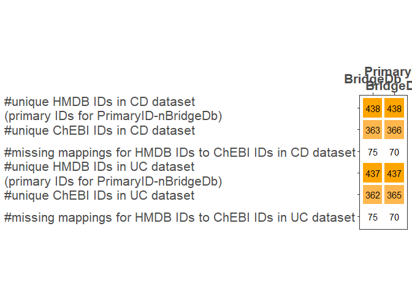

## Introduction

In this section, identifier (IDs) mapping is performed on an example
metabolomics data set, which was original annotated using HMDB symbols.
The dataset has been preprocessed already, for details see step 7 and 8
of the multi-omics workflow at:
<https://github.com/BiGCAT-UM/Transcriptomics_Metabolomics_Analysis/tree/master/metabolomics_analysis>
. We map the HGNCMDB symbols to ChEBI IDs, since tools downstream of
this step require different input formats for the IDs.

We use one tool for this mapping: BridgeDb
\[<doi:10.18129/B9.bioc.BridgeDbR>\].

## Setup

``` r
# empty the R environment
rm (list = ls())
# check if libraries are already installed, otherwise install it
if (!requireNamespace("BiocManager", quietly = TRUE)) install.packages("BiocManager")
if(!"rstudioapi" %in% installed.packages()) BiocManager::install("rstudioapi")
if(!"dplyr" %in% installed.packages()) BiocManager::install("dplyr")
if(!"BridgeDbR" %in% installed.packages()) BiocManager::install("BridgeDbR")
if(!"data.table" %in% installed.packages())install.packages("data.table")
if(!"knitr" %in% installed.packages())install.packages("knitr")
if(!"rJava" %in% installed.packages()) install.packages("rJava")
## See https://www.r-bloggers.com/2018/02/installing-rjava-on-ubuntu/ if you have issues with this package on Ubuntu.
if(!"ggplot2" %in% installed.packages()) install.packages("ggplot2")

#load libraries
suppressPackageStartupMessages({
  library(rstudioapi)
  library(dplyr)
  library(BridgeDbR)
  library(data.table)
  library(knitr)
  # library(rJava)
  library(ggplot2)

})

# set your working environment to the location where your current source file is saved into.
setwd(dirname(rstudioapi::getSourceEditorContext()$path))
```

## Importing dataset

The data will be read for two diseases

``` r
mbx_dataset_CD <- read.csv("data/mbxData_CD.csv") %>% 
  select (HMDB_ID, Compound_Name, foldchange_disorder, p_values_disorder) %>% #filter out unused columns
  rename (HMDBID = HMDB_ID, log2FC = foldchange_disorder, pvalue = p_values_disorder) #change column names
mbx_dataset_UC <- read.csv("data/mbxData_UC.csv") %>%
  select (HMDB_ID, Compound_Name, foldchange_disorder, p_values_disorder) %>% #filter out unused columns
  rename (HMDBID = HMDB_ID, log2FC = foldchange_disorder, pvalue = p_values_disorder) #change column names
```

## Converting HMDB IDs to ChEBI IDs (BridgeDb)

``` r
##Download the Metabolite mapping file (if it doesn't exist locally yet):
checkfile <- paste0(getwd(), '/' ,"data/metabolites.bridge")
if (!file.exists(checkfile)) {
download.file("https://figshare.com/ndownloader/files/26001794", checkfile)
}
#Load the ID mapper:
mapper <- loadDatabase(checkfile)

## Obtain the System codes for the databases HMDB (source database of dataset) and ChEBI (intended output database)
code_mappingFrom <- getSystemCode("HMDB")
code_mappingTo <- getSystemCode("ChEBI")

# TODO:: there are duplicated HMDB IDs in the datasets, maybe it should first be fixed based on the metabolite names
## Create a data frame with the mappings and the correct SystemCode
input <- data.frame(
    source = rep(code_mappingFrom, length(unique(c(mbx_dataset_CD$HMDBID, mbx_dataset_UC$HMDBID)))),
    identifier = unique(c(mbx_dataset_CD$HMDBID, mbx_dataset_UC$HMDBID)))
#Obtain all mappings from HMDB to ChEBI
chebiID <- maps(mapper, input, code_mappingTo) %>%
  filter(grepl("CHEBI", mapping, fixed = TRUE)) #remove all rows in the mapped data which do not include the prefix "CHEBI"
# checking the one-to-multiple mappings
if(!all(table(chebiID$identifier) == 1)) {print ("There are one-to-multiple mappings.")} else  print ("There is no one-to-multiple mapping.")
```

    ## [1] "There is no one-to-multiple mapping."

``` r
# add chebi IDs for each metabolite in the dataset
mbx_dataset_CD$ChEBI_BridgeDb <- chebiID$mapping[match(mbx_dataset_CD$HMDBID, chebiID$identifier)]
mbx_dataset_UC$ChEBI_BridgeDb <- chebiID$mapping[match(mbx_dataset_UC$HMDBID, chebiID$identifier)]
```

## Using BridgeDb for secondary to primary mapping of HMDB IDs

### mapping the HMDB IDs to primary HMDB IDs

``` r
rm(list = setdiff(ls(), c("mbx_dataset_CD", "mbx_dataset_UC"))) # removing variables that are not required
##Download the mapping file (if it doesn't exist locally yet):
checkfile <- paste0(getwd(), '/' ,"data/hmdb_secondaryToPrimaryIDs.bridge")
if (!file.exists(checkfile)) {
download.file("NOT YET UPLOADED ANYWHERE", checkfile)
}

#Load the ID mapper:
mapper <- loadDatabase(checkfile)

## Obtain the System codes for the databases HMDB 
code_mapping <- getSystemCode("HMDB")

## Create a data frame with the mappings and the correct SystemCode
input <- data.frame(source= rep(code_mapping, length(unique(c(mbx_dataset_CD$HMDBID, mbx_dataset_UC$HMDBID)))),
                    identifier = gsub("\\*", "", unique(c(mbx_dataset_CD$HMDBID, mbx_dataset_UC$HMDBID))))

#converting secondary HMDB IDs to primary HMDB IDs 
hmdbID <- maps(mapper = mapper, input, target = code_mapping) %>% 
    filter(isPrimary == "T") # Keeping only rows where the mapping is annotated as primary id (defined in BridgeDb java library when creating the derby database)

# check the one-to-multiple mappings
if(!all(table(hmdbID$identifier) == 1)) {print ("There are one-to-multiple mappings.")} else  print ("There is no one-to-multiple mapping.")
```

    ## [1] "There is no one-to-multiple mapping."

``` r
# add HMDB id for each gene symbol in the dataset
mbx_dataset_CD$Current_HMDBID <- hmdbID$mapping[match(mbx_dataset_CD$HMDBID, hmdbID$identifier)]
mbx_dataset_UC$Current_HMDBID <- hmdbID$mapping[match(mbx_dataset_UC$HMDBID, hmdbID$identifier)]
```

Checking if all the secondary HMDB ids are mapped to a primary ID

``` r
mbx_dataset_CD[is.na(mbx_dataset_CD$Current_HMDBID), ]
```

    ##          HMDBID    Compound_Name   log2FC     pvalue ChEBI_BridgeDb
    ## 320 HMDB0041876 diacetylspermine 1.760025 0.06104859           <NA>
    ##     Current_HMDBID
    ## 320           <NA>

There is only one metabolite with no primary ID. We try to finding a
primary HMDB IDs for metabolites using the compound name

``` r
# Get the metabolite name 
input <- c (mbx_dataset_CD$Compound_Name[is.na(mbx_dataset_CD$Current_HMDBID)], sub("(.)", "\\U\\1", mbx_dataset_CD$Compound_Name[is.na(mbx_dataset_CD$Current_HMDBID)], perl=TRUE)) #making sure that the metabolite would be mapped if in the database it starts with a capital letter

## Create a data frame with the mappings and the correct SystemCode
# When we created the derby database, the system code we used for the metabolite name was "O" as there was no defined system code for it
input <- data.frame(source = rep("O", length(input)), 
                    identifier = input)

#converting primary metabolite name to primary HMDB IDs 
(hmdbID <- maps(mapper = mapper, input, target = code_mapping) %>%
    filter(isPrimary == "T")) # Keeping only rows where the mapping is annotated as primary id (defined in BridgeDb java library when creating the derby database)
```

    ##                  source       identifier target     mapping isPrimary
    ## Ch:HMDB0002172:T      O Diacetylspermine     Ch HMDB0002172         T

And the current id is HMDB0002172. Adding the current id to the
mbx_dataset_CD

``` r
mbx_dataset_CD$Current_HMDBID[mbx_dataset_CD$Compound_Name == "diacetylspermine"] = hmdbID$mapping
mbx_dataset_UC$Current_HMDBID[mbx_dataset_UC$Compound_Name == "diacetylspermine"] = hmdbID$mapping
rm(list = setdiff(ls(), c("mbx_dataset_CD", "mbx_dataset_UC"))) # removing variables that are not required
```

## Converting `primary` HMDB IDs to the corresponding ChEBI IDs (BridgeDb)

``` r
rm(list = setdiff(ls(), c("mbx_dataset_CD", "mbx_dataset_UC"))) # removing variables that are not required
#Load the ID mapper:
mapper <- loadDatabase(paste0(getwd(), '/' ,"data/metabolites.bridge"))

## Obtain the System codes for the databases HMDB (source database of dataset) and ChEBI (intended output database)
code_mappingFrom <- getSystemCode("HMDB")
code_mappingTo <- getSystemCode("ChEBI")

# TODO:: there are duplicated HMDB IDs in the datasets, maybe it should first be fixed based on the metabolite names
## Create a data frame with the mappings and the correct SystemCode
input <- data.frame(
    source = rep(code_mappingFrom, length(unique(c(mbx_dataset_CD$Current_HMDBID, mbx_dataset_UC$Current_HMDBID)))),
    identifier = unique(c(mbx_dataset_CD$Current_HMDBID, mbx_dataset_UC$Current_HMDBID)))
#Obtain all mappings from primary HMDB ID to ChEBI ID
chebiID <- maps(mapper, input, code_mappingTo) %>%
  filter(grepl("CHEBI", mapping, fixed = TRUE)) #remove all rows in the mapped data which do not include the prefix "CHEBI"
# checking the one-to-multiple mappings
if(!all(table(chebiID$identifier) == 1)) {print ("There are one-to-multiple mappings.")} else  print ("There is no one-to-multiple mapping.")
```

    ## [1] "There is no one-to-multiple mapping."

``` r
# add chebi IDs for each metabolite in the dataset
mbx_dataset_CD$ChEBI_PriID_BridgeDb <- chebiID$mapping[match(mbx_dataset_CD$Current_HMDBID, chebiID$identifier)]
mbx_dataset_UC$ChEBI_PriID_BridgeDb <- chebiID$mapping[match(mbx_dataset_UC$Current_HMDBID, chebiID$identifier)]
rm(list = setdiff(ls(), c("mbx_dataset_CD", "mbx_dataset_UC"))) # removing variables that are not required
```

##Mapping stats:

| stats                                                     | BridgeDb | PrimaryID_BridgeDb |
|:-------------------------------------------------|-------:|--------------:|
| #unique HMDB IDs in CD dataset                            |          |                    |
| (primary IDs for PrimaryID-nBridgeDb)                     |      438 |                438 |
| #unique HMDB IDs in UC dataset                            |          |                    |
| (primary IDs for PrimaryID-nBridgeDb)                     |      437 |                437 |
| #unique ChEBI IDs in CD dataset                           |      363 |                366 |
| #unique ChEBI IDs in UC dataset                           |      362 |                365 |
| #missing mappings for HMDB IDs to ChEBI IDs in CD dataset |       75 |                 70 |
| #missing mappings for HMDB IDs to ChEBI IDs in UC dataset |       75 |                 70 |



##Save data, print session info, and citation

    ## R version 4.1.2 (2021-11-01)
    ## Platform: x86_64-w64-mingw32/x64 (64-bit)
    ## Running under: Windows 10 x64 (build 22000)
    ## 
    ## Matrix products: default
    ## 
    ## locale:
    ## [1] LC_COLLATE=English_United Kingdom.1252 
    ## [2] LC_CTYPE=English_United Kingdom.1252   
    ## [3] LC_MONETARY=English_United Kingdom.1252
    ## [4] LC_NUMERIC=C                           
    ## [5] LC_TIME=English_United Kingdom.1252    
    ## 
    ## attached base packages:
    ## [1] stats     graphics  grDevices utils     datasets  methods   base     
    ## 
    ## other attached packages:
    ## [1] ggplot2_3.3.6     knitr_1.39        data.table_1.14.2 BridgeDbR_2.7.2  
    ## [5] rJava_1.0-6       dplyr_1.0.9       rstudioapi_0.13  
    ## 
    ## loaded via a namespace (and not attached):
    ##  [1] Rcpp_1.0.8.3        plyr_1.8.7          highr_0.9          
    ##  [4] pillar_1.7.0        compiler_4.1.2      BiocManager_1.30.18
    ##  [7] tools_4.1.2         digest_0.6.29       evaluate_0.15      
    ## [10] lifecycle_1.0.1     tibble_3.1.7        gtable_0.3.0       
    ## [13] pkgconfig_2.0.3     rlang_1.0.2         cli_3.2.0          
    ## [16] DBI_1.1.3           curl_4.3.2          yaml_2.3.5         
    ## [19] xfun_0.31           fastmap_1.1.0       withr_2.5.0        
    ## [22] stringr_1.4.0       generics_0.1.2      vctrs_0.4.1        
    ## [25] grid_4.1.2          tidyselect_1.1.2    glue_1.6.2         
    ## [28] R6_2.5.1            fansi_1.0.3         rmarkdown_2.14     
    ## [31] farver_2.1.0        reshape2_1.4.4      purrr_0.3.4        
    ## [34] magrittr_2.0.3      scales_1.2.0        ellipsis_0.3.2     
    ## [37] htmltools_0.5.2     assertthat_0.2.1    colorspace_2.0-3   
    ## [40] utf8_1.2.2          stringi_1.7.6       munsell_0.5.0      
    ## [43] crayon_1.5.1

    ## 
    ## To cite package 'BridgeDbR' in publications use:
    ## 
    ##   Chris Leemans, Egon Willighagen, Denise Slenter, Anwesha Bohler, Lars
    ##   Eijssen and Tooba Abbassi-Daloii (2022). BridgeDbR: Code for using
    ##   BridgeDb identifier mapping framework from within R. R package
    ##   version 2.7.2. https://github.com/bridgedb/BridgeDbR
    ## 
    ## A BibTeX entry for LaTeX users is
    ## 
    ##   @Manual{,
    ##     title = {BridgeDbR: Code for using BridgeDb identifier mapping framework from within
    ## R},
    ##     author = {Chris Leemans and Egon Willighagen and Denise Slenter and Anwesha Bohler and Lars Eijssen and Tooba Abbassi-Daloii},
    ##     year = {2022},
    ##     note = {R package version 2.7.2},
    ##     url = {https://github.com/bridgedb/BridgeDbR},
    ##   }
