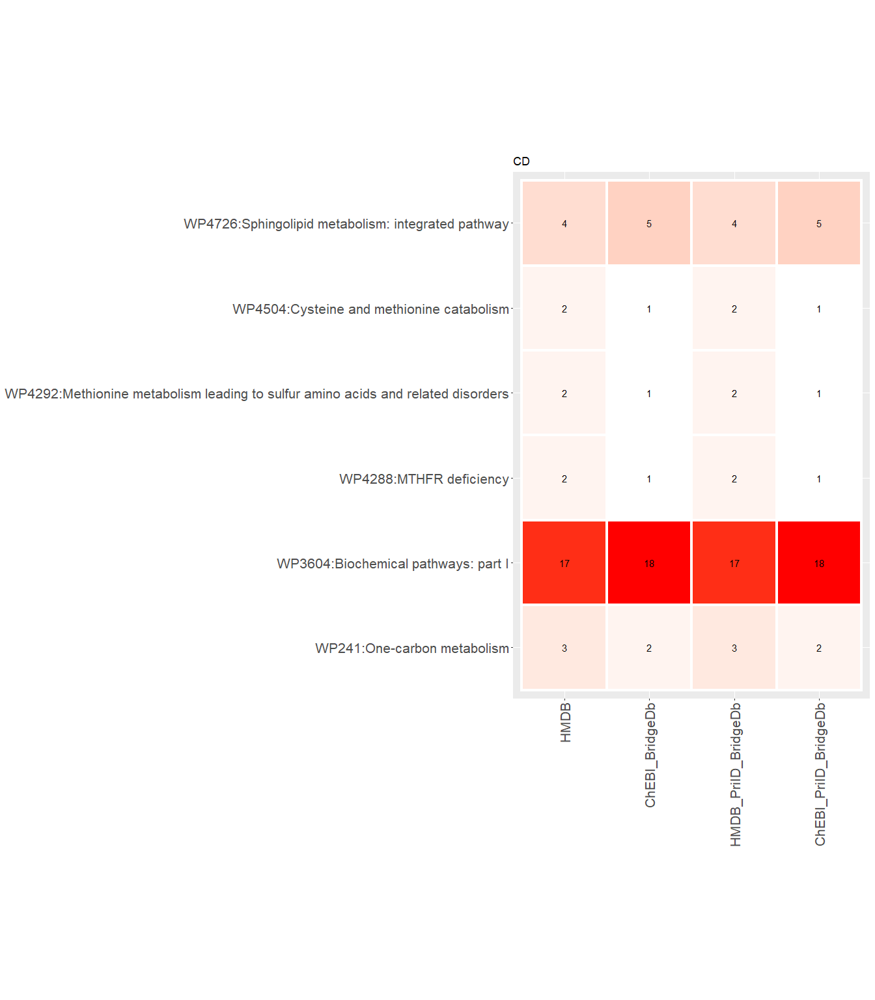

## Introduction

In this workflow, we link the metabolites of interest to pathway data
from WikiPathways, based on their HMDB and ChEBI identifiers.

## R environment setup

``` r
# empty the R environment
rm (list = ls())

# check if libraries are already installed, otherwise install it
if(!requireNamespace("BiocManager", quietly = TRUE)) install.packages("BiocManager")
if(!"rstudioapi" %in% installed.packages()) BiocManager::install("rstudioapi")
if(!"SPARQL" %in% installed.packages()) install.packages("SPARQL")
if(!"dplyr" %in% installed.packages()) install.packages("dplyr")
if(!"data.table" %in% installed.packages()) install.packages("data.table")
if(!"knitr" %in% installed.packages()) install.packages("knitr")
if(!"reshape2" %in% installed.packages()) install.packages("reshape2")
if(!"ggplot2" %in% installed.packages()) install.packages("ggplot2")

#loading installed libraries
suppressPackageStartupMessages({
  library(rstudioapi)
  library(SPARQL)
  library(dplyr)
  library(data.table)
  library(knitr)
  library(reshape2)
  library(ggplot2)
})

# set your working environment to the location where your current source file is saved into.
setwd(dirname(rstudioapi::getSourceEditorContext()$path))
```

## Importing dataset and creating the identifier lists for the pathway analysis

``` r
#We have two datasets (CD and UC disorders)
mbx_dataset_CD <- read.delim("../3-identifier_mapping_metabolomics/results/mbx_IDMapping_CD")
mbx_dataset_UC <- read.delim("../3-identifier_mapping_metabolomics/results/mbx_IDMapping_UC")

#make list of metabolites for the pathway analysis
## Significant rows
sig.rows_CD <- which((mbx_dataset_CD$log2FC >= 1 | mbx_dataset_CD$log2FC <= -1) & mbx_dataset_CD$pvalue < 0.05)
sig.rows_UC <- which((mbx_dataset_UC$log2FC >= 1 | mbx_dataset_UC$log2FC <= -1) & mbx_dataset_UC$pvalue < 0.05)
### HMDB IDs:
sig.metabolites.HMDB_CD <- na.omit(unique(mbx_dataset_CD$HMDBID[sig.rows_CD])) #CD
sig.metabolites.HMDB_UC <- na.omit(unique(mbx_dataset_UC$HMDBID[sig.rows_UC])) #UC
## BridgeDb
### ChEBI IDs:
sig.metabolites.ChEBI_BridgeDb_CD <- na.omit(unique(mbx_dataset_CD$ChEBI_BridgeDb[sig.rows_CD])) #CD
sig.metabolites.ChEBI_BridgeDb_UC <- na.omit(unique(mbx_dataset_UC$ChEBI_BridgeDb[sig.rows_UC])) #UC
## Primary id mapping, BridgeDb,
### primary HMDB IDs:
sig.metabolites.HMDB_PriID_BridgeDb_CD <- na.omit(unique(mbx_dataset_CD$Current_HMDBID[sig.rows_CD])) #CD
sig.metabolites.HMDB_PriID_BridgeDb_UC <- na.omit(unique(mbx_dataset_UC$Current_HMDBID[sig.rows_UC])) #UC
### ChEBI IDs:
sig.metabolites.ChEBI_PriID_BridgeDb_CD <- na.omit(unique(mbx_dataset_CD$ChEBI_PriID_BridgeDb[sig.rows_CD])) #CD
sig.metabolites.ChEBI_PriID_BridgeDb_UC <- na.omit(unique(mbx_dataset_UC$ChEBI_PriID_BridgeDb[sig.rows_UC])) #UC
```

## Find pathways for each dataset, based on different IDs.

``` r
##Connect to Endpoint WikiPathways
endpointwp <- "https://sparql.wikipathways.org/sparql"
## 1. Query metadata:
queryMetadata <-
"SELECT DISTINCT ?dataset (str(?titleLit) as ?title) ?date ?license 
WHERE {
   ?dataset a void:Dataset ;
   dcterms:title ?titleLit ;
   dcterms:license ?license ;
   pav:createdOn ?date .
 }"

#below code should be performed first to handle the ssl certificate error
options(RCurlOptions = list(cainfo = paste0(tempdir(), "/cacert.pem" ), ssl.verifypeer = FALSE))
resultsMetadata <- SPARQL(endpointwp, queryMetadata, curl_args = list(useragent = R.version.string))
showresultsMetadata <- resultsMetadata$results
remove(queryMetadata, resultsMetadata)

#For now, filter out Reactome PWs due to visualization issues in Cytoscape.
item1 = "PREFIX ch: <https://identifiers.org/hmdb/>
PREFIX ce: <https://identifiers.org/chebi/CHEBI:>
PREFIX cur: <http://vocabularies.wikipathways.org/wp#Curation:>
select distinct ?pathwayRes (str(?wpid) as ?pathway) (str(?title) as ?pathwayTitle) (count(distinct ?metaboliteID) AS ?BiomarkersInPWs) (count(distinct ?metaboliteDatanode) AS ?TotalMetabolitesinPW) where {
VALUES ?metaboliteID {"
item2 = "}
 
 ?metaboliteDatanode    a wp:Metabolite ;
                        dcterms:isPartOf ?pathwayRes .
 
 ?datanode  dcterms:isPartOf ?pathwayRes ;   "
item3_HMDB= "
    wp:bdbHmdb  ?metaboliteID ."
item3_ChEBI= "
     wp:bdbChEBI ?metaboliteID ." 

item4=
 " ?pathwayRes a wp:Pathway ;
             wp:organismName 'Homo sapiens' ; 
            dcterms:identifier ?wpid ;
            dc:title ?title .

  #?pathwayRes wp:ontologyTag cur:Reactome_Approved . 
  ?pathwayRes wp:ontologyTag cur:AnalysisCollection .           
}
ORDER BY DESC(?BiomarkersInPWs)"


##Split significant metabolites into list of max. 220 entries, to avoid SPARQL endpoint trowing a 414 error. 
##Merge the content of the split content back together for the output of the PW Analysis.

for (metabolite_list in ls(pattern = "sig.metabolites")){
  sig.metabolites = get (metabolite_list)
  IDsource = gsub ("_.*", "", gsub (".*\\.", "", metabolite_list))
  item3 <- get (ls (pattern = paste0("item3_", IDsource)))
  if (IDsource == "HMDB") query <- paste0("ch:", sig.metabolites)
  # if (IDsource == "ChEBI") query <- paste0("CHEBI:", sig.metabolites)
  if (IDsource == "ChEBI") query <- gsub ("CHEBI", "ce", sig.metabolites)
  # if (IDsource == "ChEBI") query <- sig.metabolites

  split_query <- split(query, ceiling(seq_along(query) / 220))
  
  showresults_CombinePWs <- c()
  for (i in 1:length (split_query)) {
    string <- paste(split_query[[i]], collapse=' ')
    query_CombinePWs <- paste(item1, string, item2, item3, item4)
    results_CombinePWs <- SPARQL(endpointwp, query_CombinePWs, curl_args = list(useragent = R.version.string))
    showresults_CombinePWs <- rbind (showresults_CombinePWs, results_CombinePWs$results)
  }
  outputFile = paste0 ("results/CombinePWs", gsub ("sig.metabolites", "", metabolite_list), ".txt")
  (showresults_CombinePWs <- showresults_CombinePWs %>% 
      group_by(pathwayRes, pathway, pathwayTitle, TotalMetabolitesinPW) %>% 
      summarise(BiomarkersInPWs = sum(BiomarkersInPWs)) %>%
      mutate(probabilities = dhyper(BiomarkersInPWs, TotalMetabolitesinPW, (length(query) - BiomarkersInPWs), length(query), log = FALSE)) %>% # Calculate hypergeometric density p-value for all pathways.
      arrange(desc(BiomarkersInPWs), probabilities)) %>%
    write.table(outputFile, sep = "\t" , quote = FALSE, row.names = FALSE)
  
  colnames(showresults_CombinePWs)[colnames(showresults_CombinePWs) == "BiomarkersInPWs"] <- paste0 ("BiomarkersInPWs", gsub ("sig.metabolites", "", metabolite_list))
  colnames(showresults_CombinePWs)[colnames(showresults_CombinePWs) == "probabilities"] <- paste0 ("probabilities", gsub ("sig.metabolites", "", metabolite_list))
  
  assign(paste0 ("CombinePWs", gsub ("sig.metabolites", "", metabolite_list)), showresults_CombinePWs)
  rm (sig.metabolites, IDsource, item3, query, split_query, showresults_CombinePWs, i, string, query_CombinePWs, results_CombinePWs, outputFile)
}
```

##Pathway Mapping stats:

``` r
MappingStats <- data.table(`  ` =  c("#significant metabolites with HMDB IDs for CD (primary in PrimaryID_BridgeDb)" ,
                                     "#pathways with HMDB IDs for CD (primary in PrimaryID_BridgeDb)",
                                     "#significant metabolites with HMDB IDs for UC (primary in PrimaryID_BridgeDb)",
                                     "#pathways with HMDB IDs for UC (primary in PrimaryID_BridgeDb)",

                                     "#significant metabolites with ChEBI IDs for CD",
                                     "#pathways with ChEBI IDs for CD",
                                     "#significant metabolites with ChEBI IDs for UC",
                                     "#pathways with ChEBI IDs for UC"),
                           BridgeDb = c(length(sig.metabolites.HMDB_CD), 
                                        length(unique(CombinePWs.HMDB_CD$pathway)),
                                        length(sig.metabolites.HMDB_UC), 
                                        length(unique(CombinePWs.HMDB_UC$pathway)),
                                        
                                        length(sig.metabolites.ChEBI_BridgeDb_CD),
                                        length(unique(CombinePWs.ChEBI_BridgeDb_CD$pathway)),
                                        length(sig.metabolites.ChEBI_BridgeDb_UC),
                                        length(unique(CombinePWs.ChEBI_BridgeDb_UC$pathway))),
                           PrimaryID_BridgeDb = c(length(sig.metabolites.HMDB_PriID_BridgeDb_CD),
                                                  length(unique(CombinePWs.HMDB_PriID_BridgeDb_CD$pathway)),
                                                  length(sig.metabolites.HMDB_PriID_BridgeDb_UC),
                                                  length(unique(CombinePWs.HMDB_PriID_BridgeDb_UC$pathway)),
                                                  
                                                  length(sig.metabolites.ChEBI_PriID_BridgeDb_CD),
                                                  length(unique(CombinePWs.ChEBI_PriID_BridgeDb_CD$pathway)),
                                                  length(sig.metabolites.ChEBI_PriID_BridgeDb_UC),
                                                  length(unique(CombinePWs.ChEBI_PriID_BridgeDb_UC$pathway))))
kable(MappingStats)
```

|                                                                               | BridgeDb | PrimaryID_BridgeDb |
|:---------------------------------------------------|------:|-------------:|
| #significant metabolites with HMDB IDs for CD (primary in PrimaryID_BridgeDb) |       97 |                 96 |
| #pathways with HMDB IDs for CD (primary in PrimaryID_BridgeDb)                |       98 |                 98 |
| #significant metabolites with HMDB IDs for UC (primary in PrimaryID_BridgeDb) |       78 |                 78 |
| #pathways with HMDB IDs for UC (primary in PrimaryID_BridgeDb)                |       62 |                 62 |
| #significant metabolites with ChEBI IDs for CD                                |       82 |                 83 |
| #pathways with ChEBI IDs for CD                                               |       97 |                 97 |
| #significant metabolites with ChEBI IDs for UC                                |       64 |                 65 |
| #pathways with ChEBI IDs for UC                                               |       61 |                 61 |

## Combining pathways for the vidualization

``` r
CombinePWs_CD <- Reduce(function(x, y) merge(x, y, all = T), lapply(ls(pattern = "Combin.*CD"), get), accumulate = F)
CombinePWs_CD %>% write.table("results/CombinePWs_CD_mbx.txt", sep = "\t" , quote = FALSE, row.names = FALSE)
CombinePWs_UC <- Reduce(function(x, y) merge(x, y, all = T), lapply(ls(pattern = "Combin.*UC"), get), accumulate = F)
CombinePWs_UC %>% write.table("results/CombinePWs_UC_mbx.txt", sep = "\t" , quote = FALSE, row.names = FALSE)

#CD
CombinePWs_CD_toPlot <- CombinePWs_CD [, !grepl("probabilities|pathwayRes|pathwayTitle|TotalMetabolitesinPW", colnames (CombinePWs_CD))] %>% select (pathway, BiomarkersInPWs.HMDB_CD, BiomarkersInPWs.ChEBI_BridgeDb_CD, BiomarkersInPWs.HMDB_PriID_BridgeDb_CD, BiomarkersInPWs.ChEBI_PriID_BridgeDb_CD)
colnames(CombinePWs_CD_toPlot) <- gsub ("BiomarkersInPWs.|_CD", "", colnames(CombinePWs_CD_toPlot))
all_the_same <- apply(CombinePWs_CD_toPlot[-c(1, 2)], 1, function(x) all(x == x[1]))
#Keep the pathways with different number of BiomarkersInPWs across different mappings
CombinePWs_CD_toPlot <- CombinePWs_CD_toPlot %>%
  filter(!all_the_same) %>%
  reshape2::melt() %>%
  mutate(pathway = paste0(pathway, ":", CombinePWs_CD$pathwayTitle[match(pathway, CombinePWs_CD$pathway)]),
         value = ifelse (is.na(value), 0, value))

(Int_PWs_CD <- unique(gsub (":.*", "", CombinePWs_CD_toPlot$pathway))) %>% 
  write.table("results/Int_PWs_CD_mbx.txt", sep = "\t" , quote = FALSE, row.names = FALSE)


ggplot(CombinePWs_CD_toPlot, aes(x = variable, y = pathway, fill = value)) +
  geom_tile(color = "white",
            lwd = 1.5,
            linetype = 1) +
  coord_fixed() +
  scale_fill_gradient(low = "white", high = "red") +
  labs(y = NULL, x = NULL) +
  geom_text(aes(label = value), color = "black", size = 4) +
  theme(axis.text.x = element_text(angle = 90, vjust = 0.5, hjust = 1, size = 16),
        axis.text.y = element_text(size = 16),
        legend.position = "none") +
  ggtitle("CD")
```



``` r
#UC
CombinePWs_UC_toPlot <- CombinePWs_UC [, !grepl("probabilities|pathwayRes|pathwayTitle|TotalMetabolitesinPW", colnames (CombinePWs_UC))] %>% select (pathway, BiomarkersInPWs.HMDB_UC, BiomarkersInPWs.ChEBI_BridgeDb_UC, BiomarkersInPWs.HMDB_PriID_BridgeDb_UC, BiomarkersInPWs.ChEBI_PriID_BridgeDb_UC)
colnames(CombinePWs_UC_toPlot) <- gsub ("BiomarkersInPWs.|_UC", "", colnames(CombinePWs_UC_toPlot))
#Keep the pathways with different number of BiomarkersInPWs across different mappings
all_the_same <- apply(CombinePWs_UC_toPlot[-c(1, 2)], 1, function(x) all(x == x[1]))
CombinePWs_UC_toPlot <- CombinePWs_UC_toPlot %>%
  filter(!all_the_same) %>%
  reshape2::melt() %>%
  mutate(pathway = paste0(pathway, ":", CombinePWs_UC$pathwayTitle[match(pathway, CombinePWs_UC$pathway)]),
         value = ifelse (is.na(value), 0, value))

(Int_PWs_UC <- unique(gsub (":.*", "", CombinePWs_UC_toPlot$pathway))) %>% 
  write.table("results/Int_PWs_UC_mbx.txt", sep = "\t" , quote = FALSE, row.names = FALSE)

ggplot(CombinePWs_UC_toPlot, aes(x = variable, y = pathway, fill = value)) +
  geom_tile(color = "white",
            lwd = 1.5,
            linetype = 1) +
  coord_fixed() +
  scale_fill_gradient(low = "white", high = "red") +
  labs(y = NULL, x = NULL) +
  geom_text(aes(label = value), color = "black", size = 4) +
  theme(axis.text.x = element_text(angle = 90, vjust = 0.5, hjust = 1, size = 16),
        axis.text.y = element_text(size = 16),
        legend.position = "none") +
  ggtitle("UC") 
```


##Print session info and remove datasets:

    ## R version 4.1.2 (2021-11-01)
    ## Platform: x86_64-w64-mingw32/x64 (64-bit)
    ## Running under: Windows 10 x64 (build 22000)
    ## 
    ## Matrix products: default
    ## 
    ## locale:
    ## [1] LC_COLLATE=English_United Kingdom.1252 
    ## [2] LC_CTYPE=English_United Kingdom.1252   
    ## [3] LC_MONETARY=English_United Kingdom.1252
    ## [4] LC_NUMERIC=C                           
    ## [5] LC_TIME=English_United Kingdom.1252    
    ## 
    ## attached base packages:
    ## [1] stats     graphics  grDevices utils     datasets  methods   base     
    ## 
    ## other attached packages:
    ## [1] ggplot2_3.3.6     reshape2_1.4.4    knitr_1.39        data.table_1.14.2
    ## [5] dplyr_1.0.9       SPARQL_1.16       RCurl_1.98-1.6    XML_3.99-0.10    
    ## [9] rstudioapi_0.13  
    ## 
    ## loaded via a namespace (and not attached):
    ##  [1] Rcpp_1.0.8.3        highr_0.9           pillar_1.7.0       
    ##  [4] compiler_4.1.2      BiocManager_1.30.18 plyr_1.8.7         
    ##  [7] bitops_1.0-7        tools_4.1.2         digest_0.6.29      
    ## [10] gtable_0.3.0        evaluate_0.15       lifecycle_1.0.1    
    ## [13] tibble_3.1.7        pkgconfig_2.0.3     rlang_1.0.2        
    ## [16] cli_3.2.0           DBI_1.1.3           yaml_2.3.5         
    ## [19] xfun_0.31           fastmap_1.1.0       withr_2.5.0        
    ## [22] stringr_1.4.0       generics_0.1.2      vctrs_0.4.1        
    ## [25] grid_4.1.2          tidyselect_1.1.2    glue_1.6.2         
    ## [28] R6_2.5.1            fansi_1.0.3         rmarkdown_2.14     
    ## [31] farver_2.1.0        purrr_0.3.4         magrittr_2.0.3     
    ## [34] scales_1.2.0        ellipsis_0.3.2      htmltools_0.5.2    
    ## [37] assertthat_0.2.1    colorspace_2.0-3    utf8_1.2.2         
    ## [40] stringi_1.7.6       munsell_0.5.0       crayon_1.5.1
